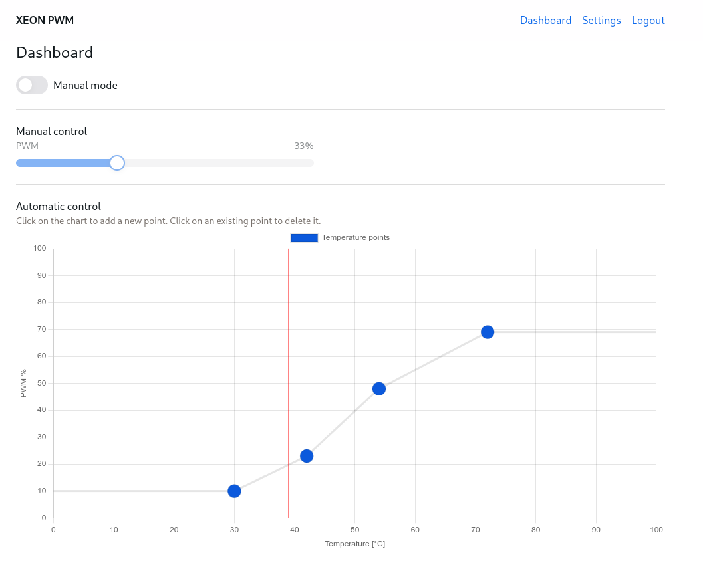
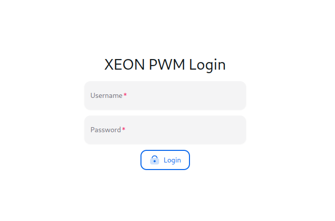

# XEON PWM Panel

XEON PWM is an application which I developed to control my server fans using my makeshift controller.

This is the frontend part. It is written using [React](https://react.dev) + 
[NextUI](https://nextui.org/) (which includes [tailwindcss](https://tailwindcss.com/)).
The app mainly uses [SignalR](https://github.com/dotnet/aspnetcore/tree/main/src/SignalR) 
to communicate with the ASP.NET Core backend (plain HTTP(S) is only used for authentication).

## Other repos
Links to related repos:
- ASP.NET Core backend: [TODO: Add](about:blank) 
- Arduino code: [TODO: Add](about:blank)

## Features
- manual mode
- automatic control based on current temperature

## Run the app
Here is how you can run the app:
1. Clone the repo
2. `npm install`
3. `npm run start`.

Although you would need to set up the ASP.NET Core 
backend as well (which requires the physical controller). 

## Screenshots

### Dashboard

### Login panel

